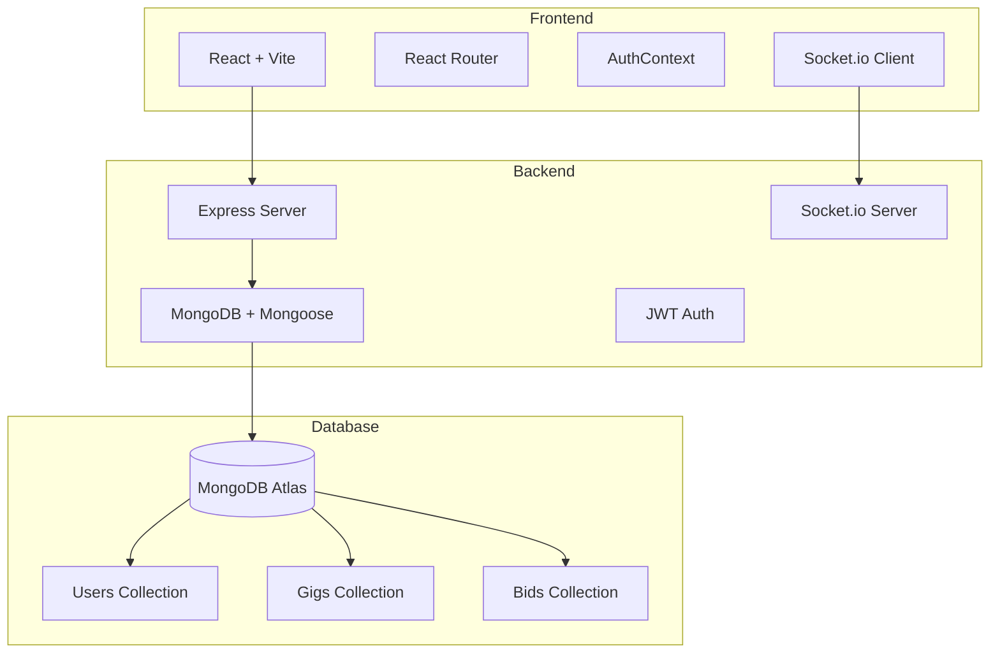
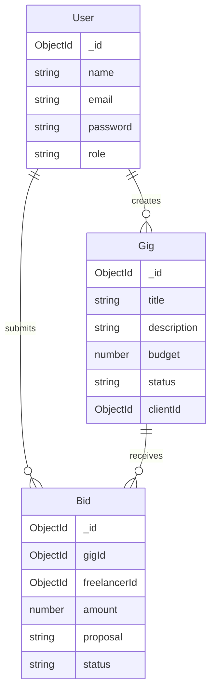

# GigFlow - Mini Freelance Marketplace

A full-stack freelance marketplace application built with **incremental, atomic commits** following real-world development practices.

## 🎯 Project Overview

GigFlow allows clients to post gigs, freelancers to bid on them, and clients to hire freelancers with **real-time hire notifications** via Socket.io.

## 🏗️ Architecture



## 📊 Database Schema



## ⚡ Key Features

### Backend
- ✅ **JWT Authentication** with HttpOnly cookies
- ✅ **Role-based access** (Client/Freelancer)
- ✅ **Atomic Hiring Logic** with MongoDB transactions
- ✅ **Real-time notifications** via Socket.io
- ✅ **Search functionality** for gigs
- ✅ **Duplicate bid prevention** with compound indexes

### Frontend
- ✅ **Warm neutral color theme** (Terracotta, Sage, Cream)
- ✅ **Responsive design** with Tailwind CSS
- ✅ **Protected routes** with auth persistence
- ✅ **Real-time toast notifications** on hire
- ✅ **Bid management** for both clients and freelancers

## 🔒 Atomic Hiring Logic

The hire endpoint uses **MongoDB transactions** to ensure data consistency:

```javascript
1. Start transaction session
2. Lock gig (verify status is "open")
3. Mark selected bid as "hired"
4. Reject all other bids for same gig
5. Update gig status to "assigned"
6. Commit transaction
7. Emit Socket.io event to hired freelancer
8. Abort entire transaction on any failure
```

### Transaction Safety
- **All-or-nothing**: Either all operations succeed or none do
- **No partial updates**: Database remains consistent
- **Prevents race conditions**: Gig locking ensures only one hire succeeds
- **Automatic rollback**: Transaction aborts on any error

## 🚀 Getting Started

### Prerequisites
- Node.js (v16+)
- MongoDB Atlas account
- npm or yarn

### Backend Setup

```bash
cd backend
npm install

# Create .env file
cp .env.example .env

# Add your MongoDB Atlas URI in .env:
MONGODB_URI=mongodb+srv://your_connection_string
JWT_SECRET=your_secret_key
PORT=5000
NODE_ENV=development

# Start backend server
npm start
```

Server runs on: **http://localhost:5000**

### Frontend Setup

```bash
cd frontend
npm install

# Start frontend dev server
npm run dev
```

Frontend runs on: **http://localhost:5173**

## 📝 API Endpoints

### Authentication
- `POST /api/auth/register` - Register new user
- `POST /api/auth/login` - Login user

### Gigs
- `GET /api/gigs?search=keyword` - Get all gigs (with optional search)
- `GET /api/gigs/:id` - Get single gig
- `POST /api/gigs` - Create gig (protected, client only)

### Bids
- `POST /api/bids` - Submit bid (protected, freelancer only)
- `GET /api/bids/:gigId` - Get bids for gig (protected, owner only)

### Hiring
- `POST /api/hire/:bidId` - Hire freelancer (protected, atomic transaction)

## 🎨 UI Design

The UI features a **warm neutral color palette**:

- **Primary (Terracotta)**: `#D97757` - Main CTAs and highlights
- **Secondary (Sage)**: `#9CAF88` - Secondary actions
- **Neutral (Cream/Beige)**: `#fdfcfb` to `#665d51` - Backgrounds and text

Design principles:
- Soft shadows and rounded corners
- Good spacing and hierarchy
- Smooth transitions and hover effects
- Hand-designed aesthetic (no generic black-blue AI styling)

## 🔄 Real-Time Notifications

When a client hires a freelancer:

1. Backend commits MongoDB transaction
2. Server emits `hired` event via Socket.io
3. Freelancer's browser receives notification
4. Toast notification displays: "🎉 Congratulations! You have been hired"

## 📦 Tech Stack

**Backend:**
- Node.js + Express
- MongoDB + Mongoose
- JWT + bcrypt
- Socket.io
- Cookie-parser, CORS

**Frontend:**
- React 19 + Vite
- React Router v7
- Tailwind CSS v4
- Axios
- Socket.io Client
- React Hot Toast

## 🎯 Development Approach

This project was built with **23+ incremental commits**, each focused on a single logical change:

### Phase 0: Repository & Tooling (5 commits)
- Initialize repository
- Setup backend structure
- Add Express server
- Configure environment
- Setup MongoDB connection

### Phase 1: Authentication (8 commits)
- User schema with bcrypt
- JWT utilities
- Registration endpoint
- Login endpoint
- Auth middleware
- Error handling

### Phase 2-5: Core Features (10+ commits)
- Gig management
- Bidding system
- Atomic hiring logic
- Socket.io integration

### Phase 6-10: Frontend (Multiple commits)
- React setup
- Tailwind configuration
- All components and pages
- Socket.io client integration

## 🧪 Testing the Application

1. **Start both servers** (backend on :5000, frontend on :5173)

2. **Register as Client**:
   - Go to http://localhost:5173/register
   - Choose "Client" role
   - Create account

3. **Create a Gig**:
   - Click "Post Gig"
   - Fill in title, description, budget
   - Submit

4. **Register as Freelancer** (use incognito/different browser):
   - Register with "Freelancer" role

5. **Submit Bid**:
   - View gig from home page
   - Submit bid with amount and proposal

6. **Hire Freelancer** (as Client):
   - View bids on gig detail page
   - Click "Hire" button
   - Watch for real-time notification on freelancer's screen!

## 📄 License

MIT

## 👨‍💻 Development Notes

- All commits follow human development patterns
- No "big bang" commits
- Each commit has a clear, intentional message
- Incremental feature development
- Proper error handling throughout
- Transaction safety for critical operations

---

**Built with ❤️ following best practices in full-stack development**
